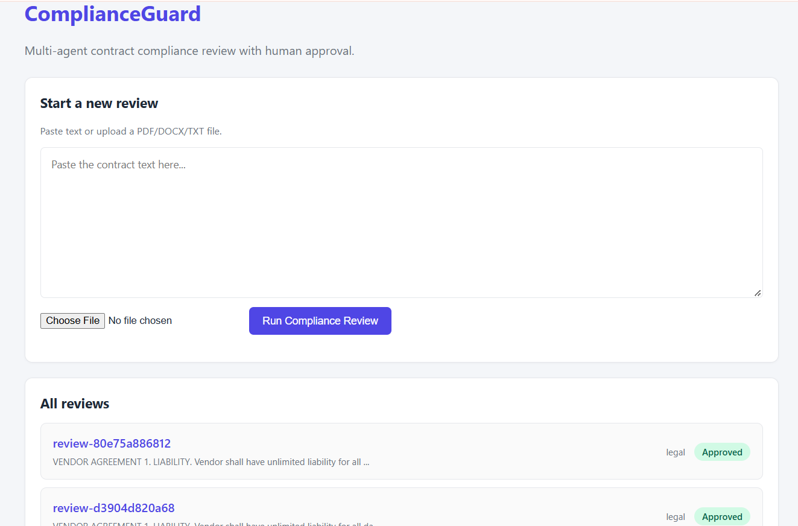

# ComplianceGuard — Multi-Agent Contract Review

A multi-agent AI system that reviews vendor agreements for compliance violations
and pauses for human approval before finalizing.

Demonstrates: agentic orchestration, conditional routing, retrieval-augmented
rules lookup, and human-in-the-loop workflows.

## Architecture

Flow: Classifier -> [conditional] -> Specialist -> Aggregator -> Human Approval Gate -> Final State

Every specialist retrieves relevant rules from a vector store built on ChromaDB +
sentence-transformers (RAG).

## Demo

Multi-agent review with a pause for human approval.

## Features

- Supervisor architecture — classifier routes to the right specialist
- Multi-agent collaboration — legal, finance, and general specialists
- RAG-grounded rules — compliance rules retrieved semantically
- Human-in-the-loop — LangGraph interrupt() pauses for approval
- Persistent checkpoints — SQLite saves state across restarts
- Resumable execution — Command(resume=...) continues where it paused
- Django web UI — upload, review, approve/reject
- Markdown-rendered reports — professional output

## Tech Stack

| Layer | Tool |
|-------|------|
| Orchestration | LangGraph 1.0 |
| LLM | Groq GPT-OSS-120B (free tier) |
| Embeddings | sentence-transformers (all-MiniLM-L6-v2, 384-d) |
| Vector Store | ChromaDB (persistent) |
| Checkpointer | langgraph-checkpoint-sqlite |
| Web | Django 6.1 |
| Parsing | pypdf, python-docx |

## Setup

### 1. Clone & install

git clone https://github.com/mxolisi78/ComplianceGuard.git
cd ComplianceGuard
python -m venv venv
.\venv\Scripts\Activate.ps1
pip install -r requirements.txt

### 2. Get a Groq API key (free)

Sign up at https://console.groq.com then API Keys then Create API Key.

### 3. Configure environment

Tip: copy .env.example to .env and fill in your values.

copy .env.example .env

### 4. Seed the compliance rules

python seed_rules.py

### 5. Run

python manage.py migrate
python manage.py runserver

Open http://127.0.0.1:8000/

## Usage

1. Paste a contract or upload PDF/DOCX
2. Click "Run Compliance Review"
3. Wait ~10-15 seconds while the agent team analyzes the document
4. Review the compliance report
5. Approve or Reject with optional notes
6. See the final decision on the review page

Reviews persist across server restarts via SQLite checkpointing.

## What I Learned

1. Agentic AI is about state, not prompts.
2. Human-in-the-loop is a design pattern, not a feature.
3. Checkpointing changes everything.
4. Multi-agent is a spectrum.
5. RAG and agents compose naturally.

## Limitations

- Single-user, no auth
- No role-based approval
- No streaming
- Only 10 seed rules
- Groq dependency

## Future Work

- Authentication + RBAC
- Live agent trace
- Multi-tenant rules
- Contract diffing
- Export to PDF
- Deploy to Railway/Render

## License

MIT — see LICENSE.

## Author

Mxolisi Maseko

- GitHub: @mxolisi78
- LinkedIn: Mxolisi Maseko
